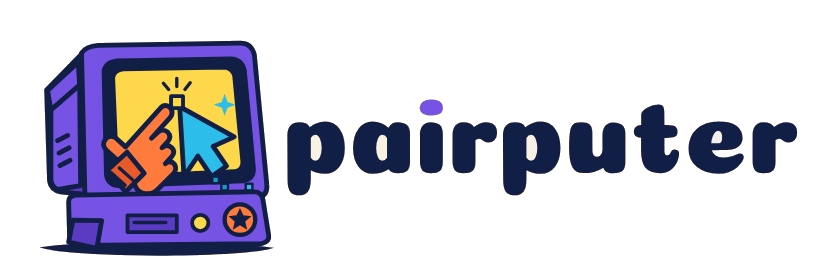

<div align="center">
  <picture>
    <source media="(prefers-color-scheme: dark)" srcset="./brand/pairputer-logo-dark.png">
    <source media="(prefers-color-scheme: light)" srcset="./brand/pairputer-logo-light.png">
    
  </picture>
</div>

> **Experimental — NOT for production.** pairputer on AWS is for hands-on testing and exploration. Deploy only into an AWS account YOU OWN and control. Never into shared, customer, or production environments. You are responsible for the resources it creates and the cost they incur.

**Stream a live Linux MicroVM into your AI chat. Video, audio, keyboard, mouse. Runs entirely in your own AWS account.**

pairputer is a deployable *substrate*: it runs an interactive **capsule** (a Lambda MicroVM workload) and streams it inline into an AI chat client. 

You get a live viewport, the model gets a controlled tool surface, and you're both driving the same machine. It suspends on idle (**Freeze**) and resumes on demand (**Thaw**), so you only pay while you're actually using it.

Connect two connectors, **ChatGPT (web)** and **Claude (web)**, and pairputer works across web, desktop, and mobile for each, including **Codex**. Once connected, open the reference capsule with a single prompt:

> Open workbench using pairputer MCP

Connector setup: [`docs/chatgpt.md`](./docs/chatgpt.md) · [`docs/claude.md`](./docs/claude.md).

The bundled reference capsule is the **Pairputer Workbench**: a disposable, resumable Linux dev desktop (browser, VS Code, terminal) that you and whichever frontier AI you prefer operate together. 

A `persistent/` folder holding your git identity, editor settings, and projects survives Freeze, Thaw, and even Trash; everything else dies with the VM. You and the AI can drop files into it from the desktop or over chat.

## Why pairputer

- **Runs in *your* AWS account.** No third-party SaaS holds your session, and no static credentials leave your machine.
- **True 1-click.** Signed, digest-pinned public images plus a public capsule build context. Nothing to build locally.
- **Secure by construction.** OAuth (Cognito PKCE), a private VPC data plane behind CloudFront + WAF, and cosign-signed images with SLSA provenance you can verify yourself.
- **Bring your own workload.** The Workbench is the default. The substrate is capsule-agnostic, and any capsule deploys as a cartridge with `substrate/deploy-capsule.sh <capsule-dir>`.

## Deploy it

<details>
<summary>1-click deploy instructions, region notes, and cost estimates</summary>

**One click, in `us-east-1`.** No tools, no clone, no Docker - everything builds in your account from
signed public images.

[](https://console.aws.amazon.com/cloudformation/home?region=us-east-1#/stacks/create/review?templateURL=https://pairputer-launch.s3.amazonaws.com/templates/pairputer.yaml&stackName=pairputer)

Click the button, enter **one input: your email address** (it becomes the super-admin account and receives the invite), and deploy. Everything else defaults to pairputer's signed public images and the Pairputer Workbench capsule. Behind the scenes it stands up Cognito, the MCP control plane (Bedrock AgentCore), a private CloudFront-fronted data plane, and builds the Workbench MicroVM image in your account. To customize the deploy (private images, your own VPC, durable storage, region), every parameter is documented in [`docs/1-click-advanced.md`](./docs/1-click-advanced.md).

After it finishes, you get an **admin invite email** with your temporary password. Then add the pairputer connector in ChatGPT (web) and Claude (web) using your stack's `McpEndpoint` output (see [`docs/chatgpt.md`](./docs/chatgpt.md) / [`docs/claude.md`](./docs/claude.md)) and play.

**`us-east-1` is the tested and recommended region.** The template isn't hard-locked to it, but other
regions are unverified and you're on your own there: the CloudFront-scope WAF only exists in `us-east-1`
(deploy elsewhere and it's skipped unless you pass your own `WebAclArn`), and Bedrock AgentCore + Lambda
MicroVM availability varies by region.

*Want to verify the images first?* Run [`scripts/verify-images.sh`](./scripts/verify-images.sh), an offline cosign signature + SLSA check.

**💸 What does it create, and what does it cost?** See [**docs/1-click-cost.md**](./docs/1-click-cost.md):
a complete inventory of every AWS resource and IAM role the 1-click deploys (each linked to its
CloudFormation source) plus honest daily/weekly/monthly cost estimates. TL;DR: roughly **$55-60/month**
always-on, about **$0.60 per active hour** of Workbench use, and near $0 while Frozen.

</details>

## Options worth knowing

<details>
<summary>Deploy parameters worth changing from the defaults</summary>

Leave every parameter at its default for the standard deploy. Two are worth knowing about:

- **Bundle reference capsule** *(default on)*: ships the Pairputer Workbench so the substrate is useful out of the box. Turn it off for a **bare substrate** with no capsule.
- **Image source** *(default `Public`)*: the signed public images. Advanced users can set `Private` to run their own private-ECR images (leave the URIs blank to auto-copy ours in, verified first).

</details>

## Remove everything

<details>
<summary>Teardown commands and what gets deleted</summary>

```bash
substrate/remove-cf.sh            # delete the stack (all nested stacks go with it)
substrate/remove-cf.sh --all      # also remove the artifact bucket + ECR repos
substrate/remove-cf.sh --all --yes  # no confirmation prompt
```

Cartridge capsule stacks (`pairputer-capsule-*`) are deleted first automatically. Each one's reaper
terminates leftover MicroVMs and deletes its image, then the root stack tears down every nested stack
in dependency order. Nothing is left running, so the bill stops.

</details>

## Learn more

- [`docs/architecture.md`](./docs/architecture.md): how the pieces fit (diagram)
- [`docs/1-click-advanced.md`](./docs/1-click-advanced.md): every 1-click launch parameter and what it does
- [`docs/1-click-cost.md`](./docs/1-click-cost.md): every resource + IAM role + cost model
- [`SECURITY.md`](./SECURITY.md): the end-to-end supply-chain and trust model
