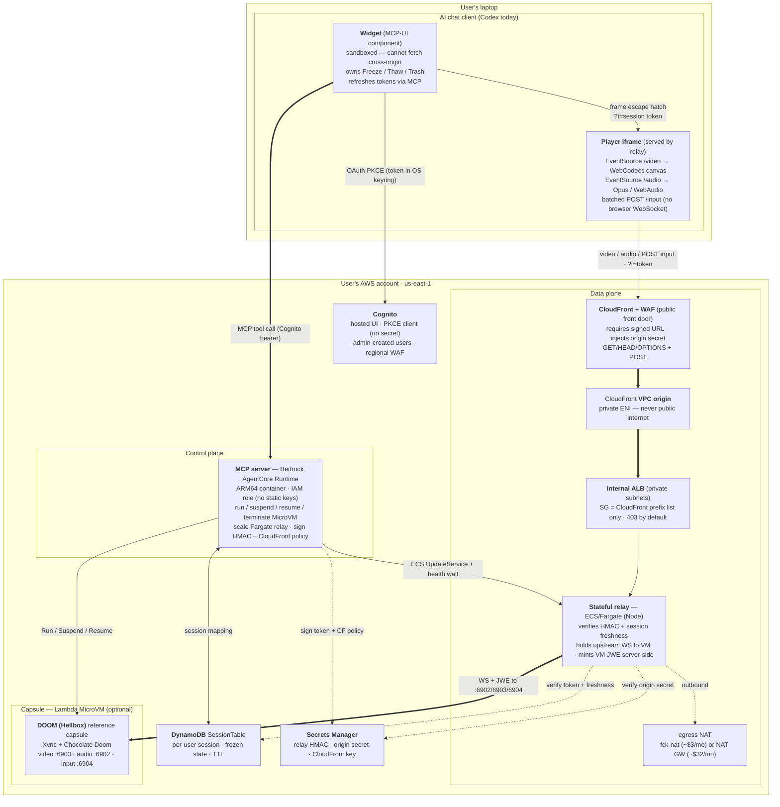
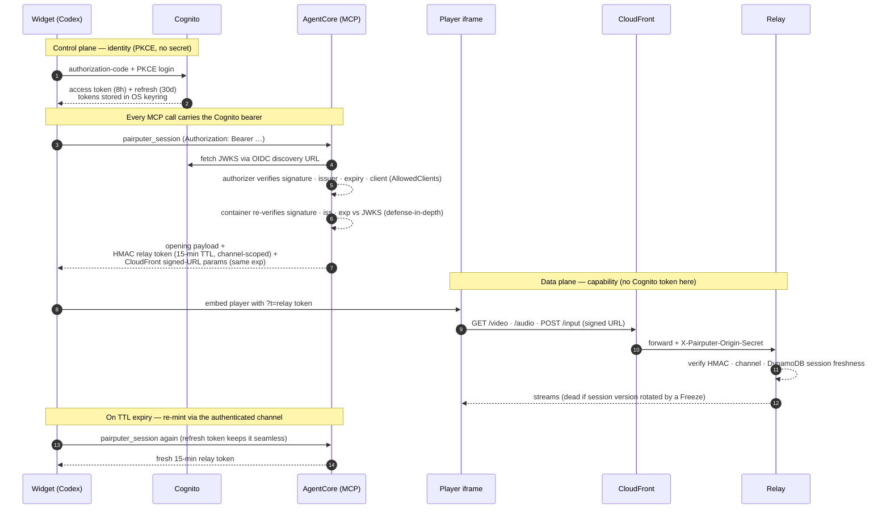

# pairputer — Architecture

pairputer streams a live Lambda **MicroVM capsule** into an AI chat client, running entirely in the
user's own AWS account. The only thing on the user's laptop is the chat app — no static AWS credentials,
no local proxy, no tunnel.

Two planes:

- **Control plane** — Codex → Cognito (OAuth PKCE) → an MCP server on **Bedrock AgentCore**. It runs,
  suspends, and resumes the MicroVM, scales the relay, and mints short-lived signed tokens.
- **Data plane** — a stateful **ECS/Fargate relay** behind **CloudFront + WAF**, reaching an **internal
  ALB** in a private VPC. Video/audio/input flow here; the MicroVM secrets never reach the browser.

---

## System diagram

---

## Deploy-time shape

The root template (`substrate/cloudformation/pairputer.yaml`) composes nested stacks. Two parameters
change what gets built:

| Parameter | Default | Effect |
|---|---|---|
| **Image source** | `Public` | `Public` = pairputer's signed public-ECR images + an API-backed AgentCore custom resource (the native CFN resource rejects public ECR). `Private` = your private-ECR images (or auto-copy ours in, verified first) + the native AgentCore resource. |
| **Bundle reference capsule** | `true` | `true` = build + register the DOOM capsule (playable out of the box). `false` = **bare substrate** — no capsule build, empty registry; capsule tools report "no capsules deployed." |
| **Networking mode** | `CreateVpcFckNat` | `CreateVpcFckNat` = dedicated VPC + a ~$3/mo fck-nat instance for egress. `CreateVpcNatGateway` = dedicated VPC + a managed NAT gateway. `ExistingVpc` = **bring your own** VPC + private subnets (they must have NAT egress). All three are proven end-to-end. |

Nested stacks: `identity` (Cognito), `security` (secrets), `sessions` (DynamoDB), `relay-network`
(VPC/NAT), `relay` (ECS/ALB/CloudFront), `cloudfront-waf`, `agentcore` (MCP runtime), plus
`microvm-image` (capsule build) and `image-copy` (private-mode copy) when applicable.

**In-stack self-healing custom resources** (so the 1-click console path works with zero external tooling):

- **fck-nat AMI resolver** (`CreateVpcFckNat` only) — resolves the current fck-nat ARM64 AMI, since the
  console can't run `deploy.sh` to look it up.
- **ALB↔CloudFront-origin SG wiring** (`relay`) — CloudFront VPC-origin traffic arrives from an AWS-created
  `CloudFront-VPCOrigins-Service-SG` (not the VPC CIDR), so a custom resource opens the internal ALB to that
  SG after the VPC origin exists. Without it the data plane is silently dead (requests never reach the ALB).
- **MicroVM reaper** (`microvm-image`) — on stack **delete**, terminates every MicroVM on the image before
  CloudFormation deletes the image, since a live/suspended VM pins it and would otherwise wedge teardown.
- **OAuth callback registrar** (`agentcore`) — computes the exact `redirect_uri` Codex will request
  (`base64url_nopad(SHA256(McpEndpoint)[:9])` appended to `http://localhost:5555/callback/`) and merges it
  into the Cognito public client's callback URLs at deploy time. So a 1-click user needs **zero AWS
  credentials** — no `redirect_mismatch`, no manual Cognito edit — and the first `codex mcp login` works.

---

## Planes in detail

**Control plane.** Codex authenticates to Cognito (authorization-code + PKCE; tokens in the OS keyring)
and calls the MCP server on Bedrock AgentCore. A tool call returns an opening payload so the widget
renders immediately; on open it calls `pairputer_session`, and AgentCore — via its IAM execution role,
no static keys — loads/creates the caller's DynamoDB session, runs/resumes the MicroVM, scales the
Fargate relay to 1, waits for a healthy ALB target, and returns a short-lived HMAC relay token plus
CloudFront signed-URL params.

**Data plane.** The widget can't fetch cross-origin (the sandbox blocks it before CSP applies), so it
**embeds** the relay-served player iframe. The player is same-origin to the relay, so `EventSource`
works for video and audio. Input is **not** a browser WebSocket — Codex's widget CSP allows only
`https://` on `connect-src` — so the player batches keyboard/mouse events into `POST /input`. CloudFront
rejects unsigned/expired traffic at the edge; the relay verifies the HMAC token + DynamoDB session
freshness on every request, mints the MicroVM JWE server-side, and holds the persistent upstream
WebSockets. **The MicroVM JWE never reaches the browser.**

For the full hop-by-hop transport/port/auth breakdown of both planes (headless tool-call chain AND the
streaming chain), OSI-mapped with the encrypted-vs-cleartext boundaries and residual gaps, see
[`data-path-osi.md`](./data-path-osi.md).

---

## Auth & token flow

Two independent grants: a long-lived, revocable **identity** (Cognito) gates the control plane; a
short-lived, session-bound **capability** (a 15-min HMAC token + matching CloudFront policy) gates the
data plane. The Cognito token never reaches the relay. Full detail — lifetimes, PKCE, JWT validation —
in [`../SECURITY.md`](../SECURITY.md#runtime-auth-cognito--agentcore-and-token-lifetimes).

---

## Lifecycle — Freeze / Thaw

- **Freeze** — the widget stops streams and drains the relay, then MCP `freeze` calls `SuspendMicrovm`
  only after atomically rotating the session and owner epoch (so stale tokens cannot regain authority),
  waits until state is truly `SUSPENDED`, and writes the frozen state to DynamoDB. **MicroVM compute
  billing pauses.** The relay warm policy (`RelayWarmSeconds`) then applies: `-1` keeps it always-on
  (the multi-tenant-safe default, instant resume); `0`/`N>0` scale the relay to zero when idle — but
  ONLY on a strongly-read count of EXACTLY 0 active sessions (a stale/failed read leaves it warm, so a
  live session is never killed). Scale-to-zero cuts the ~$15/mo Fargate line to ~$0 at idle for a
  single-user/low-concurrency deploy, at the cost of a cold start on the next connect.
- **Re-entry while frozen** — widget boot first does a non-waking control-plane read; if the VM isn't
  `RUNNING`, it shows the suspended overlay and never embeds the player. Returning to a frozen thread
  does not wake the VM.
- **Thaw** — user-initiated: rotates the session and owner epoch before resuming a suspended VM, waits
  for `RUNNING`, and only then starts streams.
- **Trash** — drains, terminates the caller's MicroVM, clears the session mapping; a recovery path.

---

## Inside the capsule

`start.sh` supervises: Xvnc (`:1`) → capsule services → Chocolate Doom (native ARM64 SDL2). Three data
ports: **video** `:6903` (ffmpeg → H.264), **audio** `:6902` (PulseAudio → Opus), **input** `:6904`
(JSON → XTEST). Input retries the X connection under a restart loop (fixes an Xvnc startup race).

The agent-doom cartridge adds an **agent brain** alongside the game: `agent_bridge.py` (`:6905`, HTTP →
gRPC into the engine) exposes observe/act/`drive_goal`, and `autopilot.py` is the idle-takeover
supervisor — human idle ~20s → the brain plays (hunt, fight, open doors, avoid nukage, respawn on death,
advance the level-exit intermission); any human input → instant handback. Explicit `drive_goal` calls are
fire-and-forget (`{status: driving}` in seconds — Codex caps remote MCP tool calls at ~25s) and preempt
the autopilot's lock. See [`capsule-architecture.md`](./capsule-architecture.md) for the full demo-loop
design and its testing rules.

`AWS::Lambda::MicrovmImage` can only be **built in-account** from an S3 context (no ECR/prebuilt import;
`BaseImageArn` is AWS-managed), so every deployer builds the image. A build-time **readiness gate** keeps
the image `503` until DOOM renders *and* an input self-test passes — with `InputSelftestEnforce=true`
(default) a build with dead input **fails** rather than snapshotting a broken capsule.

---

## Security posture (summary)

No static AWS credentials leave the laptop (OAuth PKCE only). The data plane is a private VPC behind
CloudFront + WAF; the internal ALB accepts only CloudFront (via the CloudFront-VPCOrigins service SG +
origin secret). Images are cosign-signed with SLSA provenance, digest-pinned, and independently
verifiable ([`scripts/verify-images.sh`](../scripts/verify-images.sh)).

**Auth (defense-in-depth, 2026-07-12 audit):** AgentCore's `CustomJWTAuthorizer` verifies the Cognito
JWT (signature/issuer/expiry/client/scope) before a request reaches the container; `server.py::_verify_jwt`
then INDEPENDENTLY re-verifies the RS256 signature + `iss` + `exp` against Cognito's JWKS inside the
container, so the tenant model does not rely SOLELY on AgentCore being the only ingress (fail-closed).
The CloudFront signed-URL gate is MANDATORY — `CloudFrontKeyGroupId` is required and `TrustedKeyGroups`
is unconditional, so an empty value can no longer silently disable the edge signed-URL requirement.

Full detail in [`../SECURITY.md`](../SECURITY.md).
