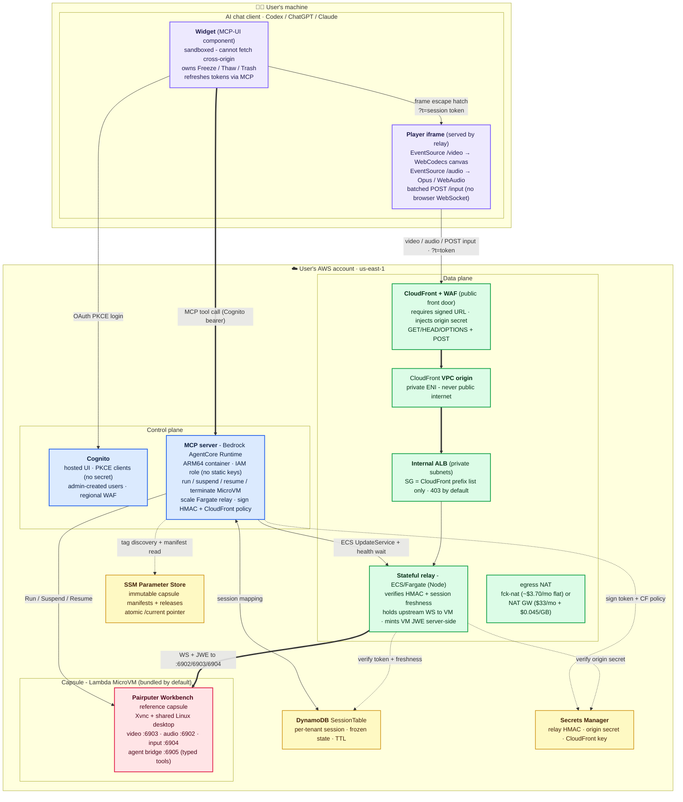
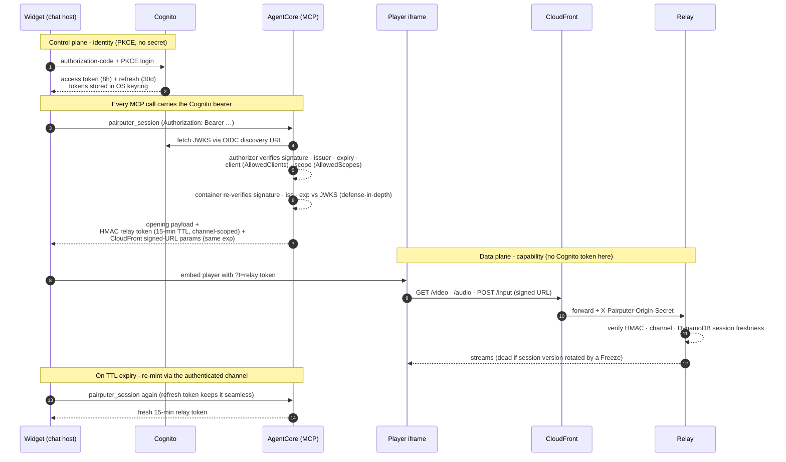

# pairputer architecture

pairputer streams a live Lambda **MicroVM capsule** into an AI chat client, running entirely in the
user's own AWS account. The only thing on the user's laptop is the chat app: no static AWS credentials,
no local proxy, no tunnel.

Two planes:

- **Control plane:** the chat host (Codex, ChatGPT, or Claude) authenticates to Cognito with OAuth
  PKCE and calls an MCP server on **Bedrock AgentCore**. It runs, suspends, and resumes the MicroVM,
  scales the relay, and mints short-lived signed tokens.
- **Data plane:** a stateful **ECS/Fargate relay** behind **CloudFront + WAF**, reaching an **internal
  ALB** in a private VPC. Video/audio/input flow here; the MicroVM secrets never reach the browser.

---

## System diagram



---

## Deploy-time shape

The root template (`substrate/cloudformation/pairputer.yaml`) composes nested stacks. Two parameters
change what gets built:

| Parameter | Default | Effect |
|---|---|---|
| **Image source** | `Public` | `Public` = pairputer's signed public-ECR images + an API-backed AgentCore custom resource (the native CFN resource rejects public ECR). `Private` = your private-ECR images (or auto-copy ours in, verified first) + the native AgentCore resource. |
| **Bundle reference capsule** | `true` | `true` = build + register the Pairputer Workbench capsule (useful out of the box). `false` = **bare substrate**: no capsule build, empty registry; capsule tools report "no capsules deployed." |
| **Networking mode** | `CreateVpcFckNat` | `CreateVpcFckNat` = dedicated VPC + a ~$3.70/mo fck-nat instance for egress (no per-GB charge). `CreateVpcNatGateway` = dedicated VPC + a managed NAT gateway ($33/mo fixed plus $0.045/GB processed). `ExistingVpc` = **bring your own** VPC + private subnets (they must have NAT egress). All three are proven end-to-end. Full cost breakdown: [`1-click-cost.md`](./1-click-cost.md). |

Nested stacks: `identity` (Cognito), `security` (secrets), `sessions` (DynamoDB), `relay-network`
(VPC/NAT), `relay` (ECS/ALB/CloudFront), `cloudfront-waf`, `agentcore` (MCP runtime), plus
`capsules/nested/capsule-stack.yaml` (the bundled Workbench build, which uses the SAME template every
cartridge capsule uses) and `image-copy` (private-mode verify-and-copy) when applicable.

**In-stack self-healing custom resources** (so the 1-click console path works with zero external tooling):

- **fck-nat AMI resolver** (`CreateVpcFckNat` only): resolves the current fck-nat ARM64 AMI at deploy
  time, so the console 1-click needs no local tooling to look it up.
- **ALB↔CloudFront-origin SG wiring** (`relay`): CloudFront VPC-origin traffic arrives from an AWS-created
  `CloudFront-VPCOrigins-Service-SG` (not the VPC CIDR), so a custom resource opens the internal ALB to that
  SG after the VPC origin exists. Without it the data plane is silently dead (requests never reach the ALB).
- **Manifest stager + release publisher** (`capsule-stack`): the stager reads the validated
  `capsule.manifest.json` out of the build-context zip in S3 and stages it as chunked immutable SSM
  parameters; after the image version is ACTIVE the publisher commits an immutable release record and
  atomically advances `/pairputer/capsules/<id>/current`. This is what lets a pure console deploy
  register a capsule with an any-size manifest and zero local tooling.
- **MicroVM reaper** (`capsule-stack`): on stack **delete**, terminates every MicroVM on the image before
  CloudFormation deletes the image, since a live/suspended VM pins it and would otherwise wedge teardown.
- **OAuth callback registrar** (`agentcore`): computes the exact `redirect_uri` Codex will request
  (`base64url_nopad(SHA256(McpEndpoint)[:9])` appended to `http://localhost:5555/callback/`) and merges it
  into the Cognito public client's callback URLs at deploy time. So a 1-click user needs **zero AWS
  credentials** (no `redirect_mismatch`, no manual Cognito edit) and the first `codex mcp login` works.

---

## Planes in detail

**Control plane.** The chat host authenticates to Cognito (authorization-code + PKCE; Codex keeps its
tokens in the OS keyring) and calls the MCP server on Bedrock AgentCore. A tool call returns an opening payload so the widget
renders immediately; on open it calls `pairputer_session`, and AgentCore (using its IAM execution role,
no static keys) loads/creates the caller's DynamoDB session, runs/resumes the MicroVM, scales the
Fargate relay to 1, waits for a healthy ALB target, and returns a short-lived HMAC relay token plus
CloudFront signed-URL params.

**Data plane.** The widget can't fetch cross-origin (the sandbox blocks it before CSP applies), so it
**embeds** the relay-served player iframe. The player is same-origin to the relay, so `EventSource`
works for video and audio. Input is **not** a browser WebSocket (the host widget CSP allows only
`https://` on `connect-src`), so the player batches keyboard/mouse events into `POST /input`. CloudFront
rejects unsigned/expired traffic at the edge; the relay verifies the HMAC token + DynamoDB session
freshness on every request, mints the MicroVM JWE server-side, and holds the persistent upstream
WebSockets. **The MicroVM JWE never reaches the browser.**

For the full hop-by-hop transport/port/auth breakdown of both planes (headless tool-call chain AND the
streaming chain), OSI-mapped with the encrypted-vs-cleartext boundaries and residual gaps, see
[`data-path-osi.md`](./data-path-osi.md).

---

## Auth and token flow

Two independent grants: a long-lived, revocable **identity** (Cognito) gates the control plane; a
short-lived, session-bound **capability** (a 15-min HMAC token + matching CloudFront policy) gates the
data plane. The Cognito token never reaches the relay. Full detail (lifetimes, PKCE, JWT validation) is in [`../SECURITY.md`](../SECURITY.md#runtime-auth-cognito--agentcore-and-token-lifetimes).



---

## How the MCP server is hosted on Bedrock AgentCore

The MCP server does not run on a server you manage. It runs as a **Bedrock AgentCore Runtime**, a
managed, serverless host for agent and MCP containers. You hand AWS a container image; AgentCore
runs it, gives it a stable HTTPS endpoint, enforces the JWT authorizer in front of it, and manages the
container's lifecycle. There is no VPC, load balancer, or EC2 instance for the control plane, and the
container holds no static AWS keys; it acts through its IAM execution role.

The runtime is created with this configuration (`agentcore.yaml`):

- **`ProtocolConfiguration: MCP`.** AgentCore speaks the Model Context Protocol to the container, so the
  chat host's MCP client talks to the runtime directly.
- **`NetworkMode: PUBLIC`.** The runtime has a public HTTPS endpoint. It is not open, though: the JWT
  authorizer below runs before any request reaches the container.
- **`RequestHeaderConfiguration.requestHeaderAllowlist: ["Authorization"]`.** Only the `Authorization`
  header is forwarded into the container. Nothing else the caller sends crosses the boundary.
- **`lifecycleConfiguration`:** `idleRuntimeSessionTimeout: 900` (an idle session is torn down after 15
  minutes) and `maxLifetime: 3600` (a session lives at most 1 hour). The chat host reconnects
  transparently using its refresh token, so these limits are invisible to the user.
- **`authorizerConfiguration.customJWTAuthorizer`:** the identity gate, described in
  [Cognito and OAuth](#cognito-and-oauth-low-level) below.

### How a call reaches it

The chat host calls one URL, the `McpEndpoint` stack output:

```
https://bedrock-agentcore.<region>.amazonaws.com/runtimes/<url-encoded runtime ARN>/invocations?qualifier=DEFAULT
```

Every call carries `Authorization: Bearer <Cognito access token>`. AgentCore's authorizer validates the
token, then forwards the MCP request to the container over the MCP protocol. The container never sees a
raw AWS credential and never terminates TLS itself; AgentCore does. Because the endpoint is a plain
AWS-hosted HTTPS URL, there is no front-door proxy, no dynamic client registration, and nothing on the
user's laptop but the chat app.

In **Public image mode** the runtime is created by an API-backed custom resource
(`Custom::PairputerAgentCoreRuntime`), because the native `AWS::BedrockAgentCore::Runtime` CloudFormation
resource rejects `public.ecr.aws` URIs; the AgentCore *API* accepts them. In **Private image mode** the
native resource is used. Either way the runtime configuration above is identical.

---

## Cognito and OAuth, low-level

Identity is a Cognito user pool created fresh in your account. No identity is shared with the project,
and no secret leaves your account. The chat host authenticates with **OAuth 2.0 authorization-code plus
PKCE**; AgentCore validates the resulting JWT; and the container validates it a second time.

### Discovery: how a host finds the auth server

pairputer publishes no custom auth metadata. A host discovers everything from the standard chain:

1. The host calls the `McpEndpoint` with no token. AgentCore replies `401` with a
   `WWW-Authenticate: Bearer resource_metadata="..."` header (RFC 9728), pointing at the protected-resource
   metadata document.
2. That document points at the Cognito issuer.
3. The host fetches Cognito's OIDC discovery document at
   `https://cognito-idp.<region>.amazonaws.com/<poolId>/.well-known/openid-configuration`, which gives it
   the authorization endpoint, token endpoint, and `jwks_uri`.

This is the `DiscoveryUrl` the runtime authorizer is configured with, and the same URL the container
re-verifies against.

### The app clients

The pool has one public client per interactive host, plus one confidential machine-to-machine client
(`identity.yaml`):

| Client | Flow | Secret | Scopes | Callback |
|---|---|---|---|---|
| Codex | authorization-code + PKCE | none (public) | `openid`, `pairputer-mcp/invoke` | your `CodexCallbackUrl` (registered at deploy time) |
| ChatGPT | authorization-code + PKCE | none (public) | `openid email phone profile`, `pairputer-mcp/invoke` | `https://chatgpt.com/connector_platform_oauth_redirect` |
| Claude | authorization-code + PKCE | none (public) | `openid email phone profile`, `pairputer-mcp/invoke` | `https://claude.ai/api/mcp/auth_callback` (and the claude.com twin) |
| M2M (smoke tests) | client_credentials | yes (confidential) | `pairputer-mcp/invoke` | none |

The interactive clients are **public PKCE clients with no secret**, so no client secret ever ships to a
laptop. The `pairputer-mcp/invoke` scope is a custom resource-server scope every token must carry to call
the runtime. ChatGPT and Claude request every scope the discovery document advertises, so those clients
allow the full standard OIDC set; narrowing it makes their OAuth popup bounce with `invalid_scope`.

Pool hardening: self-sign-up is disabled (`AllowAdminCreateUserOnly`), so a leaked callback cannot
register accounts; token revocation is on; and a regional WAF sits in front of the Cognito hosted-UI
login surface.

### Two-layer JWT verification

Every MCP call's bearer token is verified twice, independently:

1. **At the runtime (AgentCore's `customJWTAuthorizer`).** Configured with the Cognito `discoveryUrl`,
   an `allowedClients` allow-list of exactly the four client ids, and an `allowedScopes` requirement of
   `pairputer-mcp/invoke`. AgentCore fetches Cognito's JWKS and verifies the token's signature, issuer,
   expiry, client, and scope on every call, before the container runs any code. A wrong-issuer,
   expired, wrong-client, or scope-less token is rejected at the edge of the runtime.
2. **Inside the container (`server.py::_verify_jwt`).** A belt to that suspenders. If
   `PAIRPUTER_JWT_DISCOVERY_URL` is set (it is, in every real deploy), the container independently
   re-verifies the token before deriving the tenant: it requires `alg: RS256`, looks up the token's
   `kid` in Cognito's JWKS (cached for one hour, refetched once on an unknown `kid` for key rotation),
   verifies the RS256 signature with `PKCS1v15` and `SHA-256`, and checks `iss` and `exp`. It fails
   closed, raising `PermissionError` on any mismatch. So the tenant model
   (`tenant_id = sha256(iss:sub)`) never trusts unverified claims, even if a request somehow reached
   the container without passing the authorizer.

---

## Defense in depth, L1 through L7

Security is layered so that no single control is the only thing standing between an attacker and the
capsule. Reading from the network up to the application:

| Layer | Control | What it does |
|---|---|---|
| **L1 to L2 (link)** | AWS-managed backbone | The data-plane path from CloudFront to the internal ALB runs over a **CloudFront VPC origin**, a private ENI. It never traverses the public internet. |
| **L3 (network)** | Private VPC + security groups | The relay and the internal ALB run in **private subnets**. The ALB's security group accepts ingress **only** from the AWS-created `CloudFront-VPCOrigins-Service-SG`, and the Fargate tasks accept traffic only from the ALB. The control plane (AgentCore, Cognito) is AWS-managed and not in your VPC. |
| **L4 (transport)** | TLS everywhere + no browser sockets | Every hop is HTTPS/TLS: host to AgentCore, host to Cognito, browser to CloudFront. Input is **not** a browser WebSocket; the widget CSP allows only `https://` on `connect-src`, so keyboard and mouse are batched into `POST /input`. The relay-to-VM WebSockets are server-side only. |
| **L7 edge (WAF)** | CloudFront-scope WAFv2 | Managed rule groups run in front of the streaming distribution: Amazon IP reputation, known-bad-inputs, and the anonymous-IP list, plus a coarse per-source-IP rate limit (`CloudFrontWafRateLimitPerFiveMinutes`, aggregated by IP). |
| **L7 edge (signed URL)** | CloudFront trusted key group | The distribution requires a **CloudFront signed URL** on every request (`TrustedKeyGroups` is unconditional; `CloudFrontKeyGroupId` is a required parameter). An unsigned or expired request is rejected at the edge before it reaches any origin. |
| **L7 origin (shared secret)** | Origin secret header | CloudFront injects `X-Pairputer-Origin-Secret` (from Secrets Manager) on every origin request. The ALB listener rule returns **403** to any request that lacks it, so even a request that somehow reached the ALB directly is refused. |
| **L7 identity (runtime)** | AgentCore JWT authorizer | Verifies the Cognito token's signature, issuer, expiry, client, and scope before the MCP container runs. See [Cognito and OAuth](#cognito-and-oauth-low-level). |
| **L7 identity (container)** | In-container re-verification | `server.py::_verify_jwt` independently re-verifies the RS256 signature, issuer, and expiry against Cognito's JWKS, fail-closed, so the tenant model does not depend solely on the authorizer being the only ingress. |
| **L7 capability (data plane)** | Session-bound HMAC token | The Cognito token never reaches the relay. The relay is gated by a separate 15-minute, channel-scoped, HMAC-signed token bound to the DynamoDB session's id and version. The relay re-verifies the HMAC, the channel, and **session freshness** on every request, so a token minted before a Freeze (which rotates the session version) is dead inside its own TTL window. |
| **L7 tenancy (data isolation)** | Per-tenant scoping | The tenant id is derived from the verified JWT (`sha256(iss:sub)`), never chosen by the caller. Sessions, and durable per-tenant workspace storage, are keyed by it, so one authenticated principal cannot read or resume another's VM. |
| **Supply chain** | Signed, pinned images | The MCP and relay images are cosign-signed with SLSA provenance and pinned by digest, independently verifiable offline with `scripts/verify-images.sh`. See [`../SECURITY.md`](../SECURITY.md). |

The two identity layers plus the data-plane capability are the core of the model: a long-lived,
revocable **identity** (Cognito, verified twice) gates the control plane, and a short-lived,
session-bound **capability** (HMAC + matching CloudFront policy) gates the data plane. The two are
independent, so compromising one grant does not hand over the other.

---

## Lifecycle: Freeze and Thaw

- **Freeze:** the widget stops streams and drains the relay, then MCP `freeze` calls `SuspendMicrovm`
  only after atomically rotating the session and owner epoch (so stale tokens cannot regain authority),
  waits until state is truly `SUSPENDED`, and writes the frozen state to DynamoDB. **MicroVM compute
  billing pauses.** The relay warm policy (`RelayWarmSeconds`) then applies: `-1` keeps it always-on
  (the multi-tenant-safe default, instant resume); `0`/`N>0` scale the relay to zero when idle, but
  ONLY on a strongly-read count of EXACTLY 0 active sessions (a stale/failed read leaves it warm, so a
  live session is never killed). Scale-to-zero cuts the ~$15/mo Fargate line to ~$0 at idle for a
  single-user/low-concurrency deploy, at the cost of a cold start on the next connect.
- **Re-entry while frozen:** widget boot first does a non-waking control-plane read; if the VM isn't
  `RUNNING`, it shows the suspended overlay and never embeds the player. Returning to a frozen thread
  does not wake the VM.
- **Thaw** is user-initiated: it rotates the session and owner epoch before resuming a suspended VM, waits
  for `RUNNING`, and only then starts streams.
- **Trash:** drains, terminates the caller's MicroVM, clears the session mapping; a recovery path.

---

## Inside the capsule

The capsule supervises Xvnc (`:1`), the capsule services, and the shared desktop (browser, VS Code,
terminal, file manager). It exposes three data ports: **video** `:6903` (ffmpeg to H.264), **audio**
`:6902` (PulseAudio to Opus), and **input** `:6904` (JSON to XTEST). Input retries the X connection
under a restart loop, which fixes an Xvnc startup race.

An agent-interactive capsule also ships an **agent bridge** (`:6905`, HTTP/JSON per its
`capsule.yaml`) exposing its typed tools: the Workbench's confined workspace, verified task
execution, browser/UI semantics, and human-first control epochs. Each capsule is its own
CloudFormation stack (a cartridge): it builds and tags a MicroVM image, and the MCP server
discovers it at runtime by tag, so adding or removing a capsule needs no control-plane redeploy.

`AWS::Lambda::MicrovmImage` can only be **built in-account** from an S3 context (no ECR/prebuilt import;
`BaseImageArn` is AWS-managed), so every deployer builds the image. A build-time **readiness gate** keeps
the image `503` until the desktop renders *and* an input self-test passes. With `InputSelftestEnforce=true`
(default) a build with dead input **fails** rather than snapshotting a broken capsule.

---

## Security posture (summary)

No static AWS credentials leave the laptop (OAuth PKCE only). The data plane is a private VPC behind
CloudFront + WAF; the internal ALB accepts only CloudFront (using the CloudFront-VPCOrigins service SG +
origin secret). Images are cosign-signed with SLSA provenance, digest-pinned, and independently
verifiable ([`scripts/verify-images.sh`](../scripts/verify-images.sh)).

**Auth (defense-in-depth, 2026-07-12 audit):** AgentCore's `CustomJWTAuthorizer` verifies the Cognito
JWT (signature/issuer/expiry/client/scope) before a request reaches the container; `server.py::_verify_jwt`
then INDEPENDENTLY re-verifies the RS256 signature + `iss` + `exp` against Cognito's JWKS inside the
container, so the tenant model does not rely SOLELY on AgentCore being the only ingress (fail-closed).
The CloudFront signed-URL gate is MANDATORY: `CloudFrontKeyGroupId` is required and `TrustedKeyGroups`
is unconditional, so an empty value can no longer silently disable the edge signed-URL requirement.

Full detail in [`../SECURITY.md`](../SECURITY.md).
